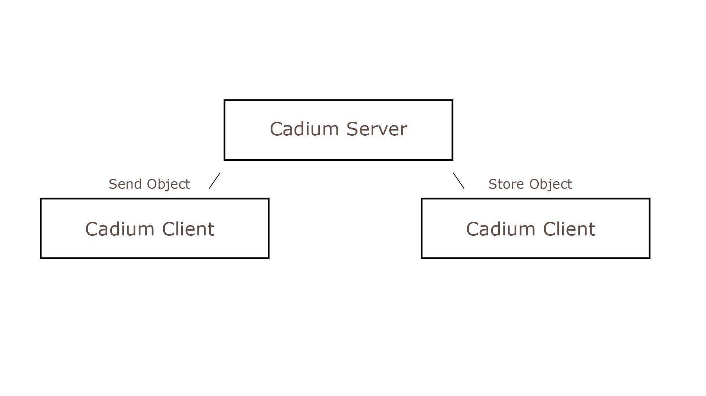

# Cadium

---

Cadium is a framework that regulates the communication of objects performantly for you.
Cadium also regulates the store and read of these objects. The object can be saved temporarily or locally using bytes or a custom
format. Of course, the object can also be saved as a Json Object without creating a custom format.

